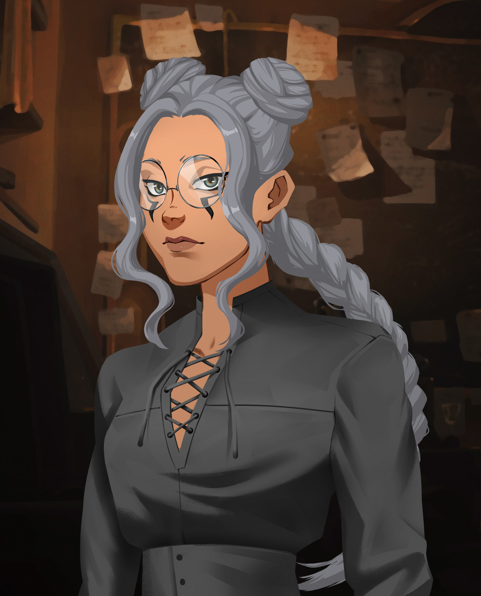

# ─────༺ Présentation ༻─────  
  
**Nom** : Lysenko  
**Prénom** : Andrea  
*Alias* : /  
  
**Âge** : 23 ans  
*Anniversaire* : 31/12  
  
**Genre** : F  
**Orientation sexuelle** : Bigouine  
  
**Race** : Sans âme  
En tant que sans âme, l'âme d'Andrea est détâchée de son corps : Andrea est une coquille vide.   
L'âme d'Andrea est rattachée à son corps par une chaîne. L'âme apparaît sous forme de spectre translucide, et peut déplacer, ou soulever, des objets qu'Andrea ne pourrait pas faire bouger. De plus, l'âme peut adopter de nombreuses formes et devenir consistante au toucher, et Andrea peut lui faire adopter différents matériaux.  
Elle peut aussi fusionner avec son spectre, mais uniquement lorsqu'elle reçoit un choc suffisamment fort, et que pour un certain temps. Ces capacités physiques seront alors décuplée.  
  
L'âme étant consistante, elle peut être capturée et enfermée dans différents objets. Lorsque c'est le cas, Andrea perd la majorité de ses sensations, et devient une marionnette pour celui qui l'a capturé. De plus, elle perd quelque faculté telle que la parole, et semble plus proche d'un zombie qu'un être humain.  
  
*Points forts* :   
- Grande force physique, endurance et vitesse  
- Télékinésie partielle  
- Elle est capable de déplacer son double sur certaines distances, sans que les murs puissent l'arrêter.   
- Elle est capable de faire adopter à son âme différente forme et matière.   
- Elle ne peut techniquement pas mourir … Mais ses blessures se régénère extrêmement lentement.  
  
*Points faibles* :  
- Plus son âme est éloignée, moins ses pouvoirs sont puissants.  
- Si son âme est enfermée, Andrea perd la majorité de ses sensations, et peut devenir une marionnette pour le détenteur de son âme.  
- Ses sensations sont en règles générale, amoindries.   
- À chaque fois qu'elle meurt, elle perd des souvenirs.   
- Seule la mort est suffisante pour la faire fusionner avec son âme, et la fusion ne peut durer plus de cinq heures.   
  
# ──────༺ Physique ༻──────  
*Taille*:   
*Poids* :   
  
**Yeux** :   
**Cheveux** :   
**Peau** :   
**Cicatrice** :   
  
**Signes distinctifs** :  
**Style vestimentaire** :   
  
  
# ──────༺ Mental ༻──────  
| Défaut | Qualité |  
| ------ | ------- |  
|        |         |  
  
| Aime | Déteste |  
| ---- | ------- |  
  
**Peurs** :   
**Tempérament** :   
**Objectifs** :   
  
# ─────༺ Élements biographiques ༻──────  
## Histoire  
  
## Relations  
  
## Trivia  
**Passion | Hobbies** :  
  
**Habitudes** :  
  
**Armes** :